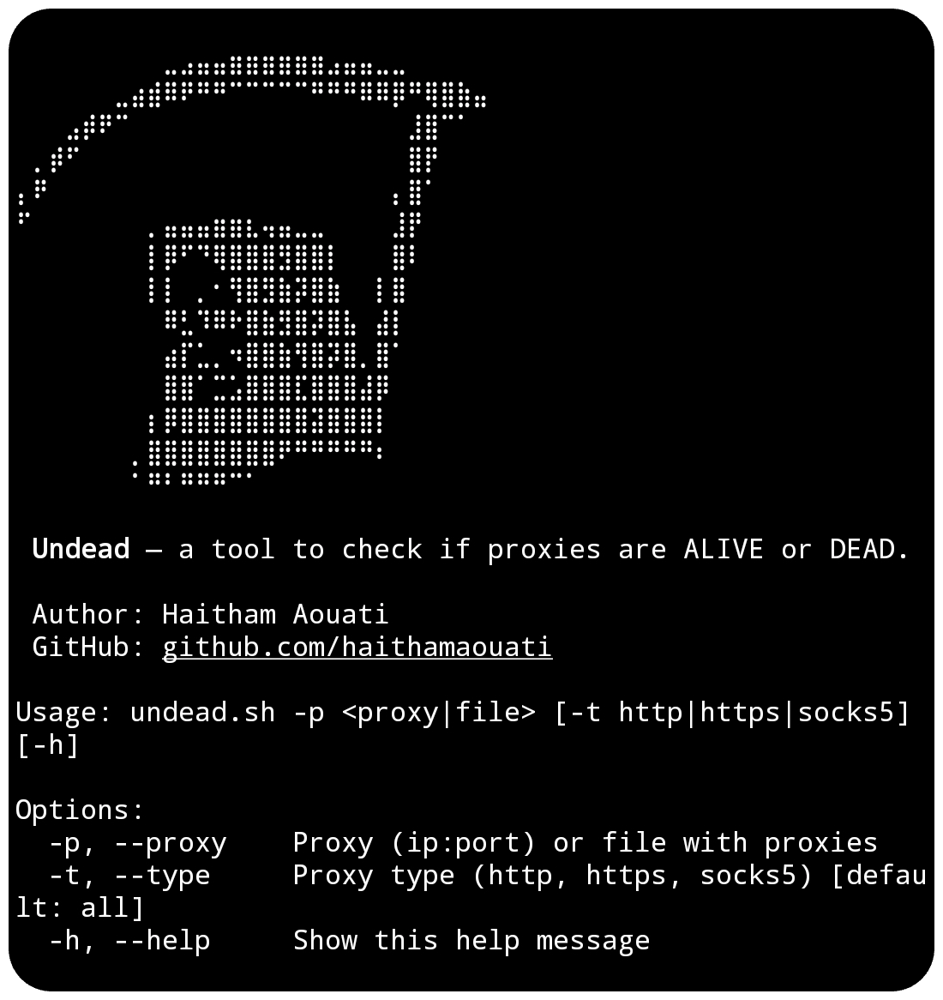

# Undead
Undead — a tool to check if proxies are ALIVE or DEAD.

## Preview


## Install

To use the Undead script, follow these steps:

1. Clone the repository:

    ```
    git clone https://github.com/haithamaouati/Undead.git
    ```

2. Change to the Undead directory:

    ```
    cd Undead
    ```
    
3. Change the file modes
    ```
    chmod +x undead.sh
    ```
    
5. Run the script:

    ```
    ./undead.sh
    ```

## Usage

   Usage: `./undead.sh -p <proxy|file> [-t http|https|socks5] [-h]`

##### Options:

`-p`, `--proxy`    Proxy `(ip:port)` or file with proxies

`-t`, `--type`     Proxy type `(http, https, socks5)` [default: all]

`-h`, `--help`       Show this help message

##### Example:

Check proxy: `./undead.sh -p ip:port`

Check proxies from a file: `./undead.sh -p proxies.txt`

Check proxies with type:
`./undead.sh -p proxies.txt -t http`

## Screenshot


## Dependencies

The script requires the following dependencies:

- [curl](https://curl.se/): `pkg install curl - y`

Make sure to install these dependencies before running the script.

## Environment
- Tested on [Termux]()

## Author

Made with :coffee: by **Haitham Aouati**
  - GitHub: [github.com/haithamaouati](https://github.com/haithamaouati)

## License

Undead is licensed under [Unlicense license](LICENSE).
